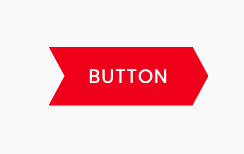
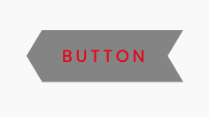
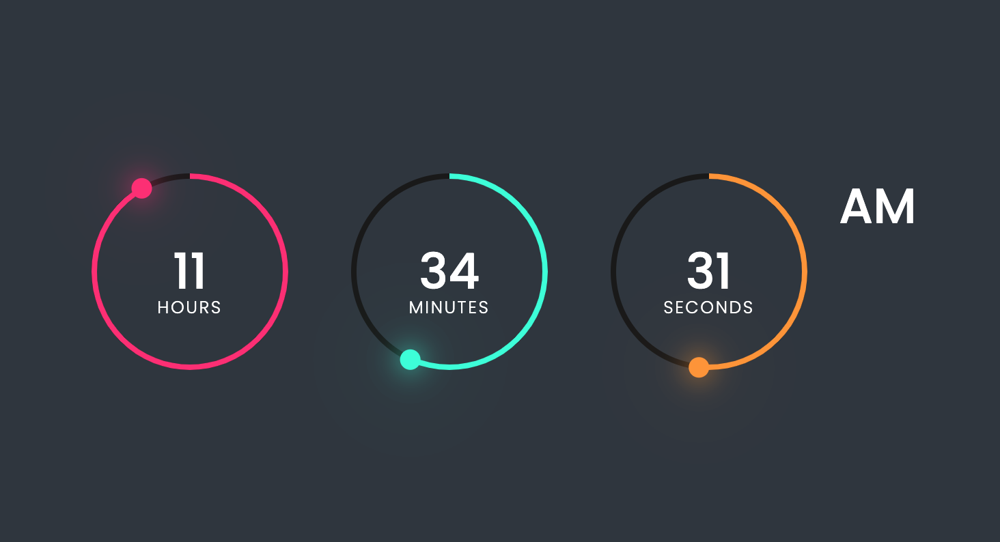
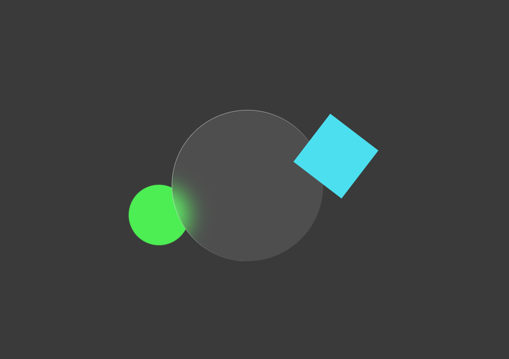
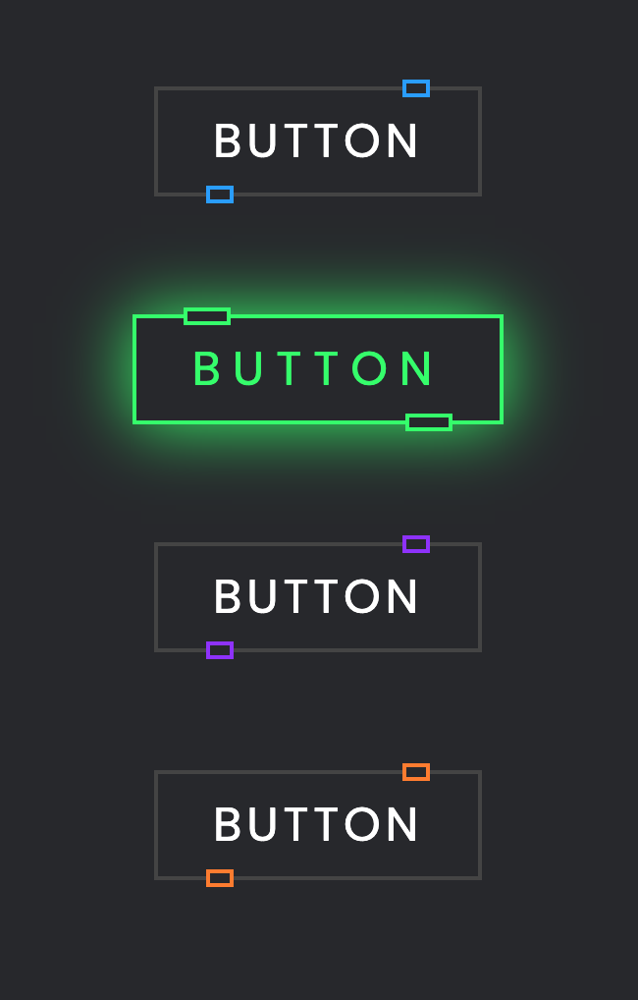
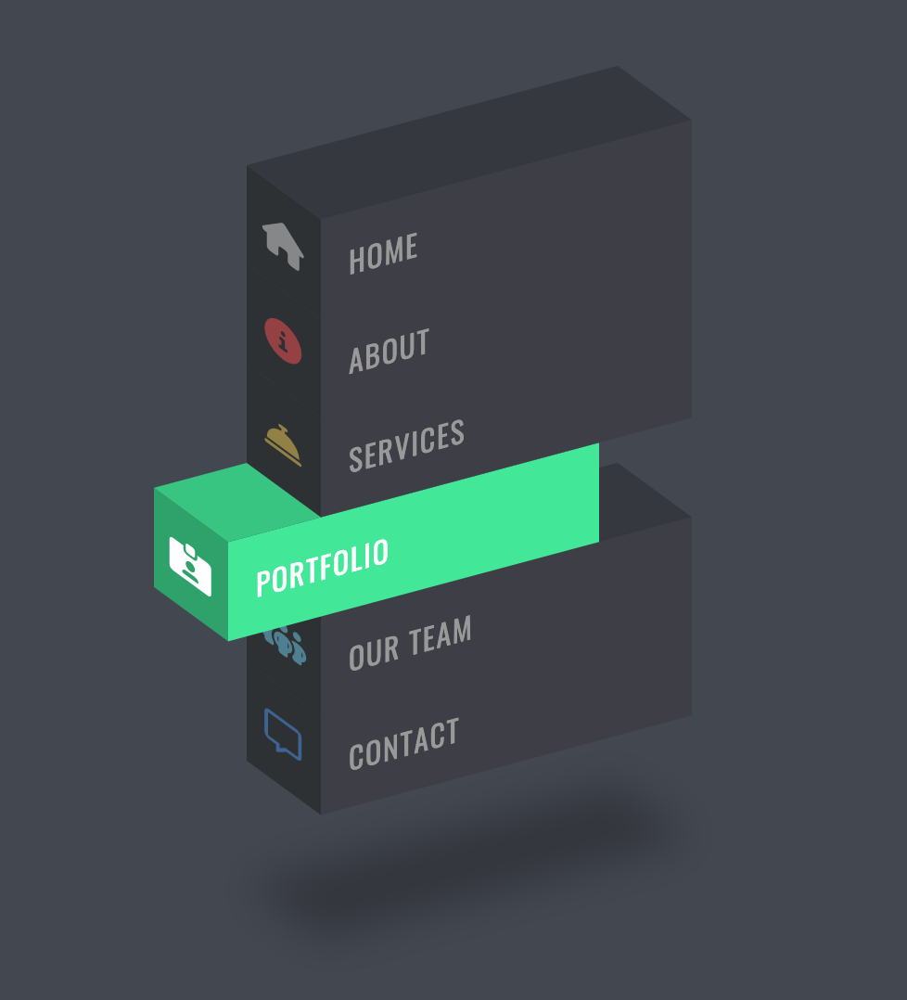
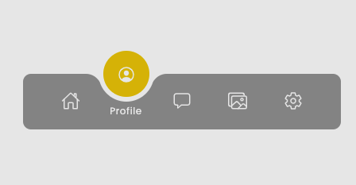

# CSS UI Demos

A collection of standalone HTML, CSS, and JavaScript projects exploring modern UI components, animations, and hover effects.

## Projects

### [Custom Shape Button with Hover Effects](custom-shape-button-with-hover-effects/)

A custom-shaped button using `clip-path` and hover effects.

### [Digital Clock](digital-clock/)

An animated digital clock built with HTML, CSS, and JavaScript.

### [Glassmorphism Animation Effects](glassmorphism-animation-effects/)

A glassmorphism-inspired animated visual effect.

### [Glowing Button Hover Effect](glowing-button-hover-effect-02/)

A button with a colorful glowing hover effect.

### [Isometric Menu Hover Effect](isometric-menu-hover-effect/)

A multi-page isometric navigation menu.

### [Magic Navigation Menu Indicator](magic-navigation-menu-indicator/)

A navigation menu with an animated active-item indicator.

