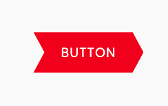
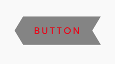

# CSS - Custom Shape Button with Hover Effects

> Button Style with Shape

Using `clip-path` css property: [clip-path](https://developer.mozilla.org/fr/docs/Web/CSS/clip-path)

[with clip path maker](https://bennettfeely.com/clippy/)

