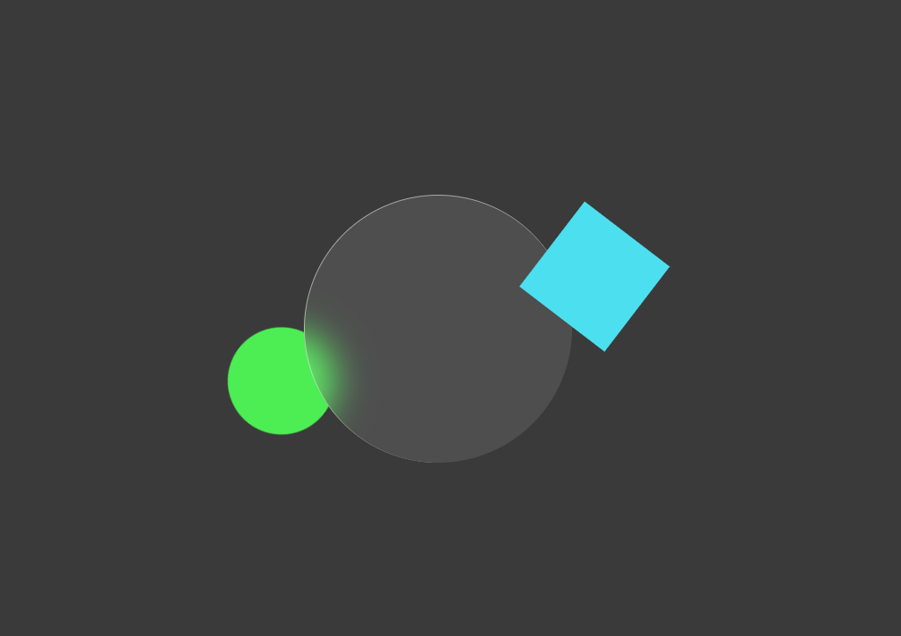

# CSS - Glassmorphism animation effect

> CSS animation with Glassmorphism effect

Using `animation: animate` for animation and `backdrop-filter: blur(10px);` for glassmorphism effect.

View more:
- [animation](https://developer.mozilla.org/fr/docs/Web/CSS/animation)
- [filter](https://developer.mozilla.org/fr/docs/Web/CSS/filter)
- [backdrop-filter](https://developer.mozilla.org/fr/docs/Web/CSS/backdrop-filter)

